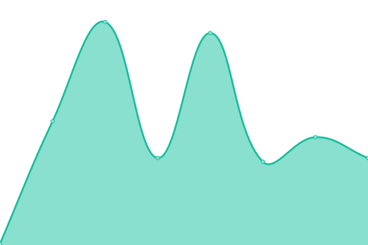

# [📈 Live Status](https://upptime.cdemi.io): <!--live status--> **🟩 All systems operational**

This repository contains the open-source uptime monitor and status page for [Christopher Demicoli](https://blog.cdemi.io/), powered by [Upptime](https://github.com/upptime/upptime).

With [Upptime](https://upptime.js.org), you can get your own unlimited and free uptime monitor and status page, powered entirely by a GitHub repository. We use [Issues](https://github.com/cdemi/upptime/issues) as incident reports, [Actions](https://github.com/cdemi/upptime/actions) as uptime monitors, and [Pages](https://upptime.cdemi.io) for the status page.

<!--start: status pages-->
<!-- This summary is generated by Upptime (https://github.com/upptime/upptime) -->
<!-- Do not edit this manually, your changes will be overwritten -->
<!-- prettier-ignore -->
| URL | Status | History | Response Time | Uptime |
| --- | ------ | ------- | ------------- | ------ |
|  [cdemi's Newsletter Archive](https://newsletters.cdemi.io/) | 🟩 Up | [cdemi-s-newsletter-archive.yml](https://github.com/cdemi/upptime/commits/HEAD/history/cdemi-s-newsletter-archive.yml) | 

 353ms
     
 | 

<a href="https://upptime.cdemi.io/history/cdemi-s-newsletter-archive">100.00%</a>
    

|  [cdemi's Newsletter Curator](https://newslettercurator.cdemi.io/health) | 🟩 Up | [cdemi-s-newsletter-curator.yml](https://github.com/cdemi/upptime/commits/HEAD/history/cdemi-s-newsletter-curator.yml) | 

 585ms
     
 | 

<a href="https://upptime.cdemi.io/history/cdemi-s-newsletter-curator">100.00%</a>
    

|  [cdemi's Blog](https://blog.cdemi.io/) | 🟩 Up | [cdemi-s-blog.yml](https://github.com/cdemi/upptime/commits/HEAD/history/cdemi-s-blog.yml) | 

 1637ms
     
 | 

<a href="https://upptime.cdemi.io/history/cdemi-s-blog">100.00%</a>
    

|  [moo.mt](https://moo.mt) | 🟩 Up | [moo-mt.yml](https://github.com/cdemi/upptime/commits/HEAD/history/moo-mt.yml) | 

 346ms
     
 | 

<a href="https://upptime.cdemi.io/history/moo-mt">100.00%</a>
    

<!--end: status pages-->

[**Visit our status website →**](https://upptime.cdemi.io)

## 📄 License

- Powered by: [Upptime](https://github.com/upptime/upptime)
- Code: [MIT](./LICENSE) © [Christopher Demicoli](https://blog.cdemi.io/)
- Data in the `./history` directory: [Open Database License](https://opendatacommons.org/licenses/odbl/1-0/)
